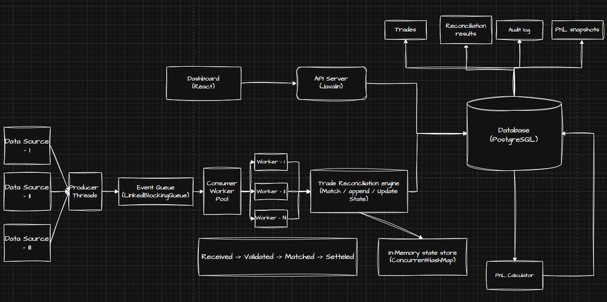

# TradeSync Engine

A **Concurrent Trade Reconciliation Engine** built in Java that simulates production-grade post-trade processing systems used in financial institutions.

The system ingests trade events from multiple sources, processes them concurrently using a producer-consumer architecture, reconciles matching records, maintains auditable state transitions, and exposes reconciliation reports and P&L analytics through REST APIs.

---

## Architecture

<p align="center">
  
</p>

### System Flow

1. Multiple data sources publish trade events.
2. Producer threads ingest events and push them into a bounded queue.
3. Consumer workers process trades concurrently.
4. The reconciliation engine validates, matches, and updates trade states.
5. Active trade state is maintained in-memory using `ConcurrentHashMap`.
6. Results are persisted to PostgreSQL.
7. Dashboard queries data through the Javalin REST API layer.
8. FIFO P&L snapshots and reconciliation reports are generated from persisted trade data.

---

## Functional Requirements

* Read and ingest trade records from multiple sources
* Match corresponding trade records
* Detect:

  * MATCHED
  * BREAK
  * MISSING
* Maintain trade lifecycle state transitions
* Generate reconciliation reports
* Track FIFO profit and loss snapshots
* Provide dashboard and API access to reconciliation data

---

## Non-Functional Requirements

* Low-latency event processing
* High throughput under concurrent load
* Data integrity and auditability
* Fault tolerance through durable persistence
* Scalable producer-consumer architecture
* Thread-safe concurrent processing

---

## Tech Stack

| Component        | Technology              |
| ---------------- | ----------------------- |
| Language         | Java 21                 |
| Build            | Maven                   |
| REST API         | Javalin 6.x             |
| Database         | PostgreSQL 16           |
| JDBC Pool        | HikariCP                |
| JSON             | Jackson                 |
| Logging          | SLF4J + Logback         |
| Testing          | JUnit 5 + Mockito       |
| Containerization | Docker + Docker Compose |

---

## Core Concepts Demonstrated

### Concurrency

* Producer-Consumer Pattern
* LinkedBlockingQueue
* Thread Pools
* ConcurrentHashMap
* AtomicReference
* LongAdder
* ReentrantReadWriteLock

### Backend Systems

* REST APIs
* Connection Pooling
* State Machines
* Audit Logging
* FIFO P&L Accounting
* Scheduled Background Jobs

### Database Engineering

* PostgreSQL
* Raw JDBC
* Prepared Statements
* Transaction Management
* Schema Design

---

## Trade Lifecycle

```text
RECEIVED
    ↓
VALIDATED
    ↓
MATCHED
    ↓
SETTLED
```

Invalid transitions are rejected and recorded in the audit trail.

---

## Quick Start

### Option 1 — Docker

```bash
docker-compose up --build

curl -H "X-API-Key: tradesync-secret-key-2024" \
http://localhost:7070/health
```

### Option 2 — Local Setup

```bash
createdb tradesync

psql -c "CREATE USER tradesync WITH PASSWORD 'tradesync_secret';"
psql -c "GRANT ALL ON DATABASE tradesync TO tradesync;"

mvn clean package -DskipTests

java -jar target/tradesync-engine-1.0.0.jar
```

---

## API Reference

All endpoints require:

```http
X-API-Key: tradesync-secret-key-2024
```

except `/health`.

| Method | Endpoint               | Description                  |
| ------ | ---------------------- | ---------------------------- |
| GET    | /health                | Health check                 |
| GET    | /trades                | Paginated trade list         |
| GET    | /trades/{id}           | Trade details                |
| POST   | /trades                | Ingest trade                 |
| GET    | /reconciliation/latest | Latest reconciliation report |
| GET    | /pnl/{symbol}          | FIFO P&L snapshot            |
| GET    | /metrics               | Throughput and queue metrics |

---

## Database Schema

```sql
trades(
    id UUID,
    symbol,
    quantity,
    price,
    side,
    state,
    created_at
)

trade_audit(
    id,
    trade_id,
    from_state,
    to_state,
    ts,
    reason
)

ledger_positions(
    id,
    book_name,
    symbol,
    quantity,
    avg_price
)

reconciliation_runs(
    id,
    run_at,
    matched,
    breaks,
    missing,
    report_json
)
```

---

## Performance Benchmark

```bash
java -jar target/tradesync-engine-1.0.0.jar \
--benchmark \
--threads=20 \
--trades=500
```

Sample Result:

```text
Threads:       20
Total Trades:  10000
Elapsed:       0.847s
Throughput:    11806 trades/sec
P50:           12µs
P99:           234µs
P99.9:         891µs
```

---

## Key Design Decisions

### Bounded Queue

`LinkedBlockingQueue` provides natural back-pressure, preventing unbounded memory growth under load.

### Concurrent State Store

`ConcurrentHashMap` allows lock-efficient access to active trade state.

### Read-Optimized Order Book

`ReentrantReadWriteLock` allows concurrent reads while preserving consistency during writes.

### FIFO P&L

Implemented using `ArrayDeque<Lot>` for efficient lot tracking and matching.

### Metrics Collection

`LongAdder` minimizes contention under high concurrency compared to `AtomicLong`.

### Reconciliation Scheduling

`ScheduledExecutorService` guarantees deterministic reconciliation runs without race conditions.

### Lock-Free Report Access

`AtomicReference<ReconciliationReport>` enables zero-copy reads from API endpoints.

---

## What This Project Demonstrates

* Concurrent programming in Java
* Producer-consumer architectures
* Financial systems engineering
* State machine design
* High-throughput event processing
* PostgreSQL integration using raw JDBC
* Thread-safe backend development
* REST API design
* Performance-oriented system design
